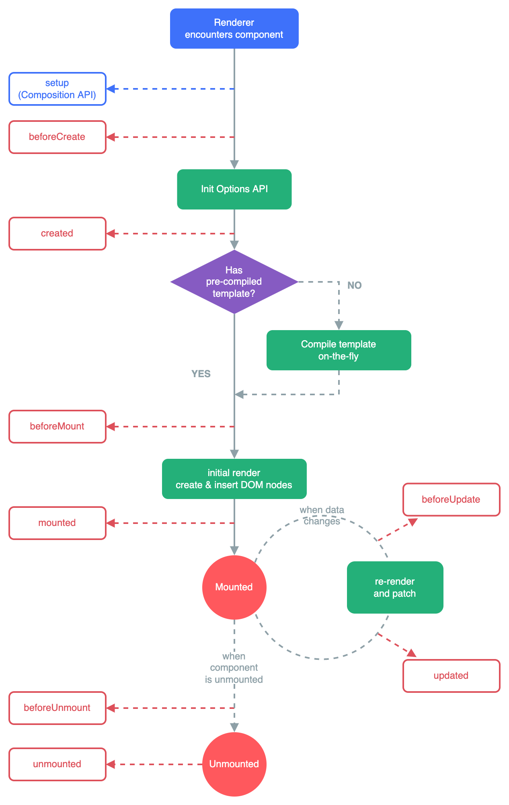

# 生命周期函数


v-if是销毁组件的，v-show是改变display值实现隐藏

# 数据共享

## 父向子传值
借助 `props`,还有 `v-bind`
### Son.vue
```vue
<template>
  <div class="son-container">
    <h1>{{msg}}</h1>
    <!--  完整写法是：(val,key,index)  -->
    <p v-for="(val, key) in user">{{`${key} : ${val}`}}</p>
  </div>
</template>

<script>
export default {
  name: "Son",
  props: {
    user: {
      default: {}
    },
    msg: {
      default: ""
    }
  }
}
</script>
```
### Dad.vue
```vue
<template>
<div class="dad-container">
  <Son :user="user" :msg="msg"></Son>
  <button @click="change">点击</button>
</div>
</template>

<script>
import Son from "@/components/Son";
export default {
  name: "Dad",
  components: {
    Son
  },
  data() {
    return {
      user: {name: "随风的叶子",age: 21},
      msg: "哈",
      cnt: 1,
    }
  },
  methods: {
    change() {
      this.user.age++
      this.user.name += this.cnt++
      this.msg += "哈"
    }
  }
}
</script>
```

## 子向父传值
使用自定义事件，自定义事件使用 `$emit`进行触发
### Dad.vue里面
```vue
methods: {
    change() {
      this.user.age++
      this.user.name += this.cnt++
      this.msg += "哈"
      /*msg改变,触发自定义事件*/
      this.$emit('msgChange',this.msg)
    }
}
```
### App.vue
```vue
<template>
  <div id="app">
    <!--  我想要获取Dad里面的msg值  -->
    <Dad @msgChange="changeMsg"></Dad>
    <h1>{{`App.vue get Dad's msg value,msg = ${msg}`}}</h1>
  </div>
</template>

<script>
export default {
  name: 'App',
  components: {
    Dad
  },
  data() {
    return {
      msg: '?',
    }
  },
  methods: {
    changeMsg(val) {
      this.msg = val
    }
  }
}
</script>
```

## 兄弟组件之间传递信息
使用一个Vue实例实现
### 创建一个Vue实例(eventBus)
```vue
import Vue from 'vue'
export default new Vue()
```
### Left.vue
```vue
<template>
<div class="left-container">
  <button @click="change">点击</button>
</div>
</template>

<script>
import eventBus from "@/js/event-bus";
export default {
  name: "Left",
  data() {
    return {
      msg: ''
    }
  },
  methods: {
    change() {
      this.msg += '1'
      eventBus.$emit('changeMsg',this.msg)
    }
  }
}
</script>
```
### Right.vue
```vue
<template>
<div class="right-container">
  {{msg}}
</div>
</template>

<script>
import eventBus from "@/js/event-bus";
export default {
  name: "Right",
  data() {
    return {
      msg: ''
    }
  },
  created() {
    eventBus.$on('changeMsg',(val)=>{
      this.msg = val
    })
  }
}
</script>
```


# ref引用
## ref简介
- ref 用来辅助开发者在不依赖于 jQuery 的情况下，获取 DOM 元素或组件的引用。
- 每个 vue 的组件实例上，都包含一个 $refs 对象，里面存储着对应的 DOM 元素或组件的引用。默认情况下， 组件的 $refs 指向一个空对象
## ref使用
- 就是在一个标签上面加上 `ref="自定义命名"`
- 获取 `this.$refs.自定义命名`
## this.$nextTick(cb) 方法
- 组件的 $nextTick(cb) 方法，会把 cb 回调推迟到下一个 DOM 更新周期之后执行。通俗的理解是：等组件的DOM 更新完成之后，再执行 cb 回调函数。从而能保证 cb 回调函数可以操作到最新的 DOM 元素。
```vue

```