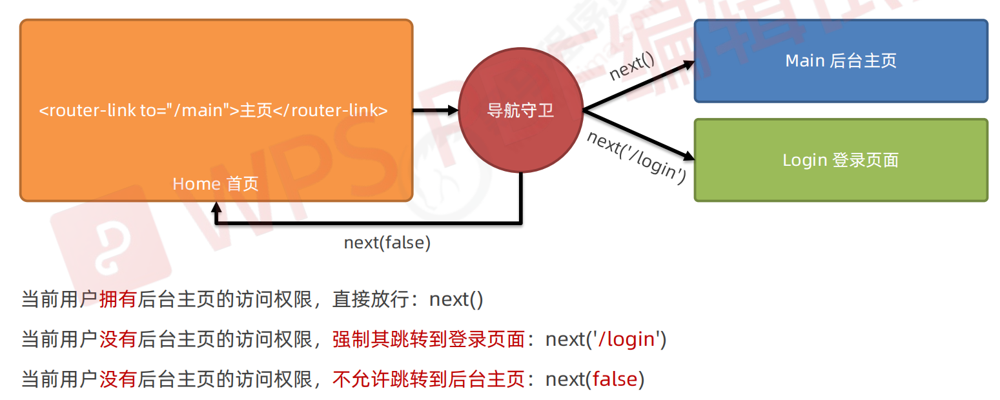

# eslint学习
- 官网
  - https://eslint.bootcss.com/
- 规则
  - 在 `.eslintrc.js`的 `rules` 那里配置

# 路由
结论：前端路由，指的是 Hash 地址与组件之间的对应关系！
## 前端路由的工作方式
- 用户点击了页面上的路由链接
- 导致了 URL 地址栏中的 Hash 值发生了变化
- 前端路由监听了到 Hash 地址的变化
- 前端路由把当前 Hash 地址对应的组件渲染都浏览器中
## 简单实现路由
```vue
<template>
  <div id="app">
    <div>
      <a href="#/Home">Home</a>
      <a href="#/About">About</a>
      <a href="#/Movie">Movie</a>
    </div>
    <component :is="compName"></component>
  </div>
</template>

<script>

export default {
  name: 'App',
  components: {},
  data() {
    return {
      compName: ''
    }
  },
  methods: {
    show() {
      console.log('哈哈哈')
    }
  },
  created() {
    // 人都麻了，居然没效果，笑死
    window.onhashchange = () => {
      console.log(location.hash)
      switch (location.hash) {
        case '#/home':
          this.compName = 'Home'
          break
        case '#/About':
          this.compName = 'About'
          break
        case '#/Movie':
          this.compName = 'Movie'
          break
      }
    }
  }
}
</script>

<style lang="less">
a {
  display: inline-block;
  text-decoration: none;
  height: 100px;
  width: 100px;
  margin: 10px 10px;
}
#app div {
  display: flex;
  justify-content: space-between;
  margin: 0 auto;
}
</style>
```
## vue-router 的基本使用
- 安装
  - npm i vue-router@3.5.2 -S (-S表示用于生产模式下)
- 配置
  - 在src/router/index.js
    - 导入到main.js的时候，默认可以不要写index.js
**router/index.js**
```js
// 导入Vue和VueRouter
import Vue from 'vue'
import VueRouter from 'vue-router'
import Home from '@/components/Home'
import Movie from '@/components/Movie'
import About from '@/components/About'

// 把VueRouter安装为Vue插件
Vue.use(VueRouter)

// 创建路由的实例对象
const router = new VueRouter({
  routes: [
    { path: '/home', component: Home },
    { path: '/movie', component: Movie },
    { path: '/about', component: About }
  ]
})

export default router
```
**main.js**
```js
import Vue from 'vue'
import App from './App.vue'
// 导入路由模块
import router from '@/router'

Vue.config.productionTip = false

new Vue({
  // 渲染App.vue
  render: h => h(App),
  // 挂载路由模块
  router: router
}).$mount('#app')
```
## vue-router 的常见用法
### 路由重定向
```js
// 创建路由的实例对象
const router = new VueRouter({
  routes: [
    // 当路径 '/' 时，跳转到 '/home'
    { path: '/', redirect: '/home' }
  ]
})
```
### 实现嵌套路由
```js
const router = new VueRouter({
  routes: [
    {
      path: '/about',
      component: About,
      children: [
        { path: 'tab01', component: Tab01 },
        { path: 'tab02', component: Tab02 }
      ]
    }
  ]
})
```
```vue
<div class="about-container">
  <h1>这个是About组件</h1>

  <div class="link">
    <router-link to="/about/tab01">Tab01</router-link>
    <router-link to="/about/tab02">Tab02</router-link>
  </div>
  <router-view></router-view>
</div>
```
### 实现动态路由
**配置router/index.js**
```js
const router = new VueRouter({
  routes: [
    { path: '/movie/:id', component: Movie }
  ]
})
```
**获取动态参数值**
- this.$route.params.id
- 配合props获取
```vue
<template>
<div class="movie-container">
  <h1>这是Movie组件,id = {{$route.params.id}},id = {{id}}}</h1>
</div>
</template>

<script>
export default {
  name: 'Movie',
  props: {
    id: {

    }
  }
}
</script>
```
```js
const router = new VueRouter({
  routes: [
    { path: '/movie/:id', component: Movie, props: true }
  ]
})
```
###  声明式导航
在浏览器中，点击链接实现导航的方式，叫做声明式导航。
- 普通网页中点击 <a> 链接、vue 项目中点击 <router-link> 都属于声明式导航
### 编程式导航
在浏览器中，调用 API 方法实现导航的方式，叫做编程式导航。
- 普通网页中调用 location.href 跳转到新页面的方式，属于编程式导航
- vue-router 中的编程式导航 API
  - this.$router.push('hash 地址')
    - 跳转到指定 hash 地址，并增加一条历史记录
  - this.$router.replace('hash 地址')
    - 跳转到指定的 hash 地址，并替换掉当前的历史记录
  - this.$router.go(数值 n)
    - 实现导航历史前进、后退
```vue
<template>
  <div>
    <button @click="$router.push('/about')">跳转到关于页面</button>
    <button @click="$router.replace('/movie/1')">电影1</button>
    <button @click="$router.go(-1)">回退</button>
    <button @click="$router.back()">回退</button>
    <button @click="$router.go(1)">前进</button>
    <button @click="$router.forward()">前进</button>
  </div>
</template>
```
### 导航守卫
- 全局前置守卫
  - router.beforeEach(fn)

```js
// 每次在进行路由的时候都会触发这个函数
// 注册全局前置守卫
router.beforeEach((to, from, next) => {
  //  to 将要访问的路由信息对象
  //  from 将要离开的路由信息对象
  //  next 调用next()表示放行,允许本次路由导航
  console.log('我被执行了')
  console.log(`哈哈哈`)
  if (to.path === '/login') return next()
  const token = localStorage.getItem('token')
  if (token !== '111.222.333') return next('/login')
  next() // 允许通过
})
```