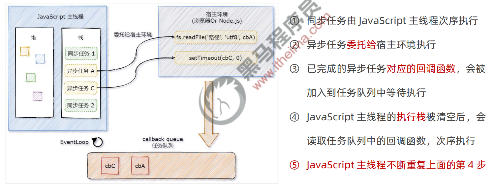
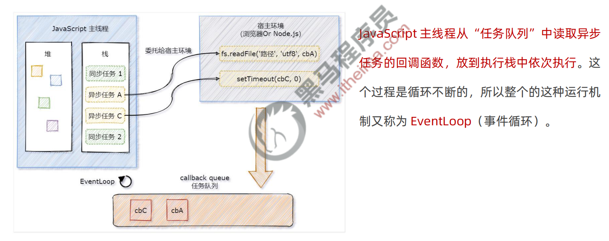
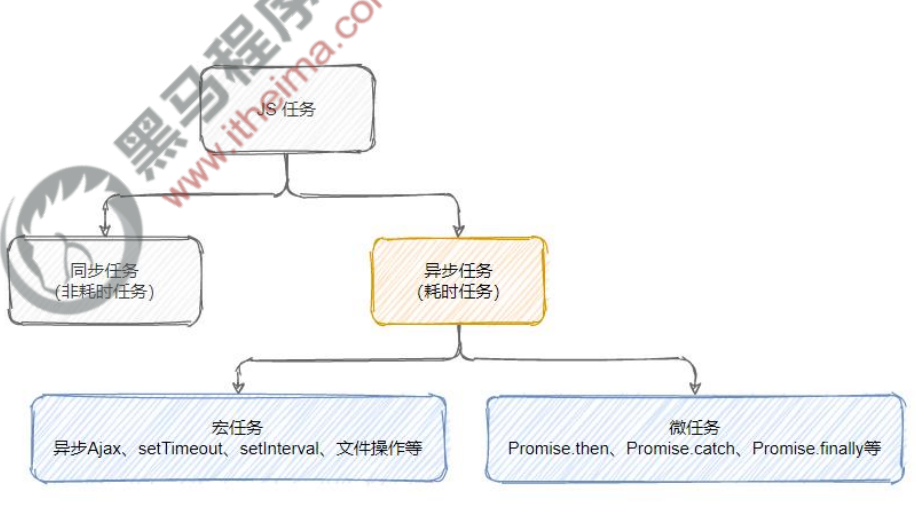
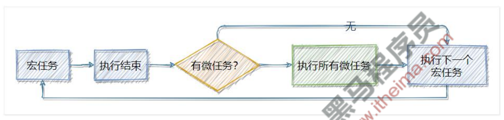
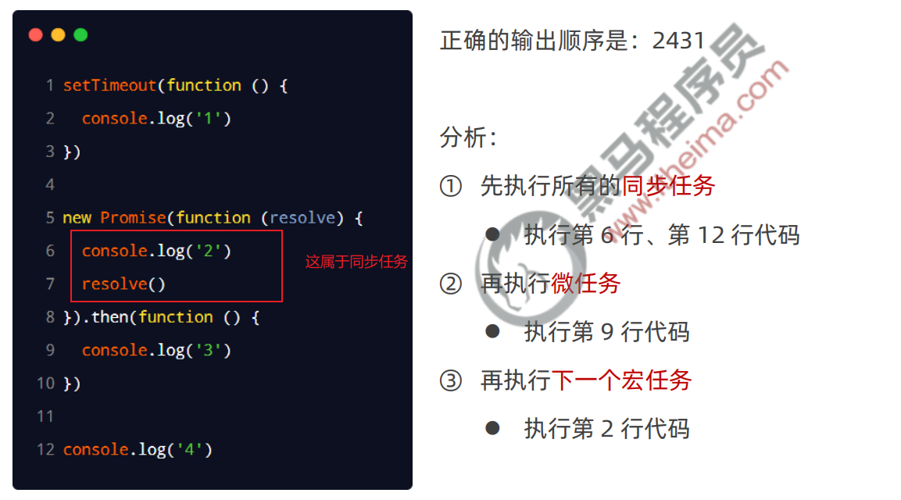

# es6
- node允许es6语法
  - 首先要保证自己node的版本是v14.15.1 或更高版本的
  - 然后就是在 `package.json`(使用 `npm init -y`生成) 中配置 `type: 'module' `
  - 最后导入的时候一定要加 '.js' 后缀,不然找不到
- 每个模块中，只允许使用唯一的一次 export default
- 默认导入时的接收名称可以任意名称，只要是合法的成员名称即可
- 按需导出
  - export 按需导出的成员
  - 需要注意：不是你想的那样，定义完后在下一行`export 变量名`,而是
    - 例子：  `export let a = 100`
- 按需导入
  - 按需导入的语法： import { s1 } from '模块标识符'
- 起别名
  - 不可以使用解构对象语法的 `:` 来重命名
```js
import {a as number} from './hi.js'
import {show as showTime} from './hi.js'
```

# Promise
问题：多层回调函数的相互嵌套，就形成了回调地狱。
解决：ES6（ECMAScript 2015）中新增了 Promise 的概念。

## 完成一个小栗子体验一下
- 安装 `npm install then-fs`
```js
import thenFs from 'then-fs'

// 这样写catch可以保证在没有遇到错误之前会一直正确执行，捕获到错误之后就不执行了
thenFs.readFile('../assets/f1.txt', 'utf8')
    .then(r1 => {
      console.log(r1)
      return thenFs.readFile('../assets/f2.txt', 'utf8')
    })
    .then(r2 => {
      console.log(r2)
      return thenFs.readFile('../assets/f3.txt', 'utf8')
    })
    .then(r3 => {
      console.log(r3)
    })
    .catch(err => {
      console.log(err.message)
    })
```

```js
import thenFs from 'then-fs'

thenFs.readFile('../assets/f1.txt','utf8')
    .catch(err => {
      console.log(err.message)
    })
    .then(r1 => {
      console.log(r1)
      return thenFs.readFile('../assets/f2.txt','utf8')
    })
    .then(r2 => {
      console.log(r2)
      return thenFs.readFile('../assets/f3.txt','utf8')
    })
    .then(r3 => {
      console.log(r3)
    })

// thenFs.readFile('../assets/f11.txt','utf8')
//     .catch(err => {
//       console.log(err.message)
//     })
//     .then(r1 => {
//       console.log(r1)
//       return thenFs.readFile('../assets/f22.txt','utf8')
//     })
//     .catch(err => {
//       console.log(err.message)
//     })
//     .then(r2 => {
//       console.log(r2)
//       return thenFs.readFile('../assets/f3.txt','utf8')
//     })
//     .catch(err => {
//       console.log(err.message)
//     })
//     .then(r3 => {
//       console.log(r3)
//     })
```
##  Promise.all() 方法
- Promise.all() 方法会发起并行的 Promise 异步操作，等所有的异步操作全部结束后才会执行下一步的 .then 操作（等待机制）。
```js
import thenFs from 'then-fs'

const arrPromise = [
  thenFs.readFile('../assets/f1.txt', 'utf8'),
  thenFs.readFile('../assets/f2.txt', 'utf8'),
  thenFs.readFile('../assets/f3.txt', 'utf8'),
]
Promise.all(arrPromise)
    // 这个写法本质上就是快速获取数组值的写法
    .then(([r1,r2,r3]) => {
      console.log(r1,r2,r3)
    })
    // .then((res) => {
    //   console.log(res)
    // })
    .catch(err => {
      console.log(err.message)
    })
```
## Promise.race() 方法
- Promise.race() 方法会发起并行的 Promise 异步操作，只要任何一个异步操作完成，就立即执行下一步的 .then 操作（赛跑机制）。
```js
import thenFs from 'then-fs'

const arrPromise = [
  thenFs.readFile('../assets/f1.txt', 'utf8'),
  thenFs.readFile('../assets/f2.txt', 'utf8'),
  thenFs.readFile('../assets/f3.txt', 'utf8'),
]

Promise.race(arrPromise)
    .then(res => {
      console.log(res)
    })
    .catch(err => {
      console.log(err.message)
    })
```
## 基于 Promise 封装读文件的方法
注意：我们new一个Promise对象的时候，传入的函数属于同步任务，会被立即执行
```js
import fs from 'fs'

function getFileContent(path) {
  return new Promise((resolve,reject) => {
    fs.readFile(path, 'utf8', (err,data) => {
      if (err) reject(err)
      resolve(data)
    })
  })
}

getFileContent('../assets/f1.txt')
    .then(r1 => {
      console.log(r1)
      return getFileContent('../assets/f2.txt')
    })
    .then(r2 => {
      console.log(r2)
      return getFileContent('../assets/f3.txt')
    })
    .then(r3 => {
      console.log(r3)
    })
```

#  async/await
- 如果在 function 中使用了 await，则 function 必须被 async 修饰
- 在 async 方法中，第一个 await 之前的代码会同步执行，await 之后的代码会异步执行(这句话的意思是await 后面那个函数异步执行,等它执行完返回结果)
  - 所以和你之前学的没有冲突
- 暂且先这样记住，后面再深究为什么
```js
import thenFs from 'then-fs'

console.log('A')
async function readFiles() {
  console.log('B')
  // 使用await修饰，返回的Promise对象，最后给到变量的是resolve返回的结果
  const r1 = await thenFs.readFile('../assets/f1.txt', 'utf8')
  const r2 = await thenFs.readFile('../assets/f2.txt', 'utf8')
  const r3 = await thenFs.readFile('../assets/f3.txt', 'utf8')
  console.log(r1,r2,r3) // 等上面三个执行完了再执行这个打印和下面的打印
  console.log('C')
}

readFiles()
console.log('D')
```
## async
- 被async定义的函数会默认返回一个Promise对象resolve的值。因此对async函数可以直接then，返回值就是then方法传入的函数。
- 
# EventLoop
## 同步任务和异步任务的执行过程
- 异步任务和同步任务怎么区分呢？看有无回调函数是可以的
- 感觉对这个执行有了新的认识



```js
import thenFs from "then-fs";

console.log('A') //首先被执行
thenFs.readFile('../assets/f1.txt', 'utf8')
    .then(r1 => {
      console.log('B') // 4
    })

setTimeout(() => {
  console.log('C') // 3
}, 0)

console.log('D') // 2
```

# 宏任务和微任务
## 什么是宏任务和微任务

## 宏任务和微任务的执行顺序

