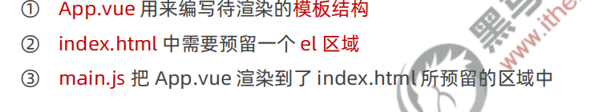
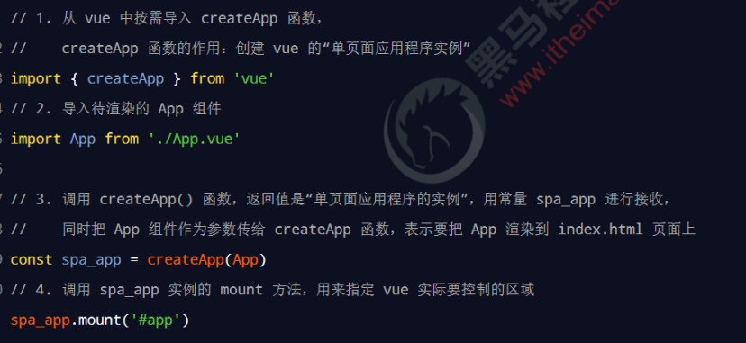

# vite 的基本使用
## 快速构建vite项目
- npm init vite-app 项目名称
- npm install
- npm run dev
- 大胆按照上面步骤走就对了
## vite项目结构分析

## vite 项目的运行流程
- 目的单纯：通过 main.js 把 App.vue 渲染到 index.html 的指定区域中。



# 组件化开发思想
- vue 是一个完全支持组件化开发的框架。vue 中规定组件的后缀名是 .vue。

# vue 组件的构成
## template -> 组件的模板结构
- 必须有的
- `<template>` 是 vue 提供的容器标签，只起到包裹性质的作用，它不会被渲染为真正的 DOM 元素。
- 在 vue 3.x 的版本中，<template> 中支持定义多个根节点


## script -> 组件的 JavaScript 行为
- 可选的
### script 中的 name 节点
- 在使用 vue-devtools 进行项目调试的时候，自定义的组件名称可以清晰的区分每个组件
- name属性指向的是当前组件的名称(建议: 每个首字母大写)
## style -> 组件的样式
- 可选的
- 安装less
  - `npm install less -D`

# 组件的基本使用
- 被全局注册的组件，可以在全局任何一个组件内使用
- 被局部注册的组件，只能在当前注册的范围内使用
## 组件注册时名称的大小写
- 使用 kebab-case 命名法（俗称短横线命名法，例如 my-swiper 和 my-search）
- 使用 PascalCase 命名法（俗称帕斯卡命名法或大驼峰命名法，例如 MySwiper 和 MySearch）
  - 开发中推荐使用
## 通过 name 属性注册组件
```js
import { createApp } from 'vue'
import App from './App.vue'
import './index.css'
import Movie from './components/Movie.vue' //vue后缀一定不要忘记加了,不然找不到

const app = createApp(App)

// 注册全局组件
app.component(Movie.name, Movie)

app.mount('#app')
```

## class 与 style 绑定
### class
- 注册单个
  - 直接三元运算符就行了
```vue
<template>
  <div :class=" isOk ? 'green' : 'red' ">字体颜色变化</div>
  <button @click="isOk = !isOk">点击</button>
</template>
```
- 注册多个
  - 数组+三元运算符
```vue
<template>
  <!-- 单个的 -->
  <div :class=" isOk ? 'green' : 'red' ">字体颜色变化</div>
  <button @click="isOk = !isOk">点击</button>
  <!-- 多个的 -->
  <div :class="[isOk ? 'green' : 'red',changeSize ? 'big' : 'small']">字体颜色和大小</div>
  <button @click="changeSize = !changeSize">点击</button>
</template>

<script>
export default {
  name: "ClassTest",
  data() {
    return {
      isOk: true,
      changeSize: true
    }
  }
}
</script>

<style lang="less" scoped>
.red {
  color: red;
}
.green {
  color: green;
}
.big {
  font-size: large;
}
.small {
  font-size: small;
}
</style>
```
### style
- :style 的对象语法十分直观——看着非常像 CSS，但其实是一个 JavaScript 对象。
```vue
<template>
  <div :style="styleObject">磐石-随风-叶润</div>
  <button @click="changeColor">换颜色</button>
</template>

<script>
export default {
  name: "StyleTest",
  data() {
    return {
      styleObject: {}
    }
  },
  methods: {
    changeColor() {
      this.styleObject.color = 'skyblue'
    }
  }
}
</script>

<style lang="less" scoped>

</style>
```