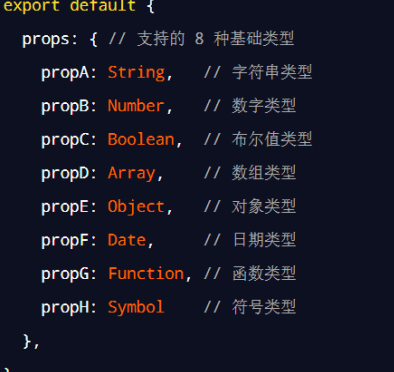
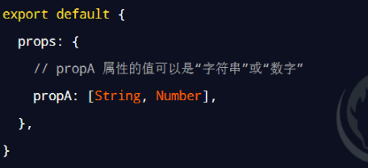
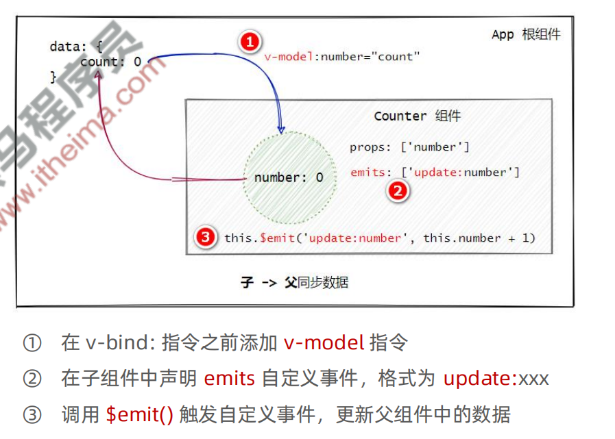

# props 验证
## 基础的类型检查
- Function, Symbol, Date, Object, Array 我还没用过

## 多个可能的类型

## 必填项校验,属性默认值
```vue
<script>
export default {
  name: "PropTest01",
  props: {
    title: String,
    many: [String, Number],
    color: {
      type: String,
      require: true,
      default: 'red'
    }
  }
}
</script>
```
## 自定义验证函数
```vue
<script>
export default {
  name: "PropTest01",
  props: {
    msg: {
      // msg的值
      validator(value) {
        // 表示value是数组中的一个值
        return ['success', 'warning', 'danger'].indexOf(value) !== -1
      }
    }
  }
}
</script>
```

# 计算属性
- 计算属性本质上就是一个 function 函数，它可以实时监听 data 中数据的变化，并 return 一个计算后的新值，供组件渲染 DOM 时使用。
## 例子
```vue
<template>
  <div>{{`count的值: ${count}`}}</div>
  <div>{{`count*2值: ${plus}`}}</div>
  <button @click="count++">+1</button>
</template>

<script>
export default {
  name: "ComputedTest01",
  data() {
    return {
      count: 0
    }
  },
  computed: {
    plus() {
      return this.count*2
    }
  }
}
</script>
```
## 注意事项
1. 计算属性必须定义在 computed 节点中
2. 计算属性必须是一个 function 函数
3. 计算属性必须有返回值
4. 计算属性必须**当做普通属性使用**
## 计算属性 vs 方法
- 相对于方法来说，计算属性**会缓存计算的结果**，只有**计算属性的依赖项发生变化时，才会重新进行运算**。
- 因此,计算属性的性能更好

# 自定义事件
## 声明自定义事件
- `emits: ['change']`
## 触发自定义事件
- `this.$emit('change')`
## 监听自定义事件
-  `<EmitsTest01 @change="getMsg"></EmitsTest01>`
```vue
<template>
  <h3>EmitsTest01组件</h3>
  <button @click="onBtnClick">+1</button>
</template>

<script>
export default {
  name: "EmitsTest01",
  emits: ['change'],
  methods: {
    onBtnClick() {
      this.$emit('change')
    }
  }
}
</script>
```
```vue
<template>
  <EmitsTest01 @change="getMsg"></EmitsTest01>
</template>
<script>
import EmitsTest01 from './components/emits/EmitsTest01.vue'
export default {
  name: 'App',
  components: {
    EmitsTest01
  },
  methods: {
    getMsg() {
      console.log('被触发了')
    }
  }
}
</script>
```
## 传参
```vue
// EmitsTest01.vue
this.$emit('change', ++this.count)
// App.vue
getMsg(val) {
console.log(`被触发了,count=${val}`)
}
```


# 组件上的 v-model

```vue
<template>
  <h3>EmitsTest02组件,count = {{number}}</h3>
  <button @click="onBtnClick">+1</button>
</template>

<script>
export default {
  name: "EmitsTest01",
  props: {
    number: {
      default: 0,
      type: Number
    }
  },
  emits: ['update:number'],
  methods: {
    onBtnClick() {
      this.$emit('update:number', this.number + 1)
    }
  }
}
</script>
```
```vue
<EmitsTest02 v-model:number="count"></EmitsTest02>
```