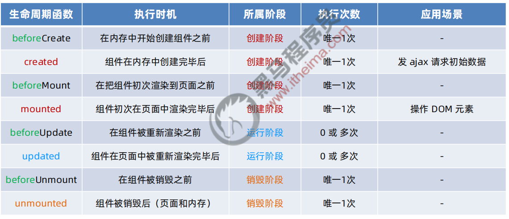
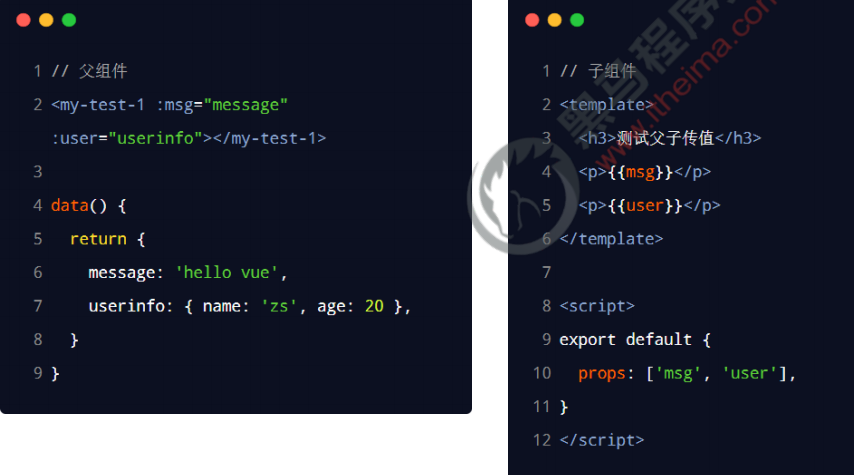
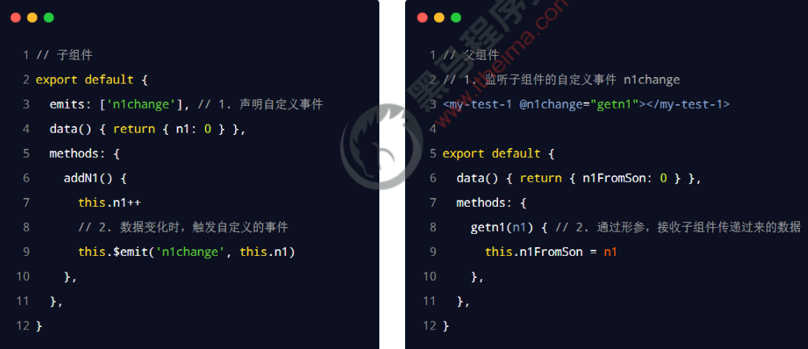
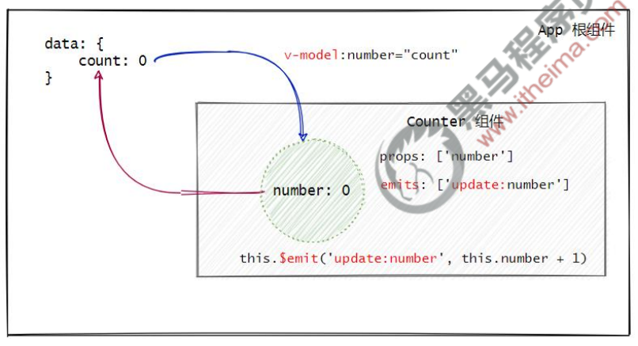
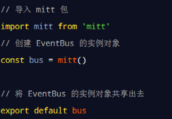
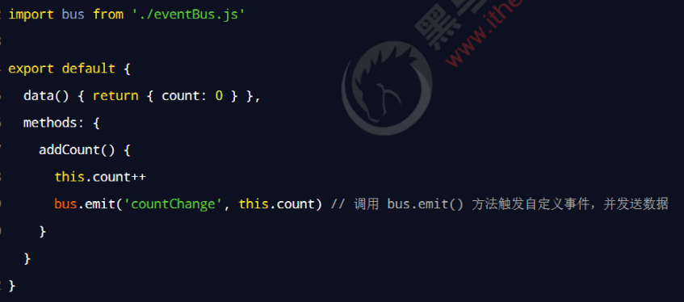
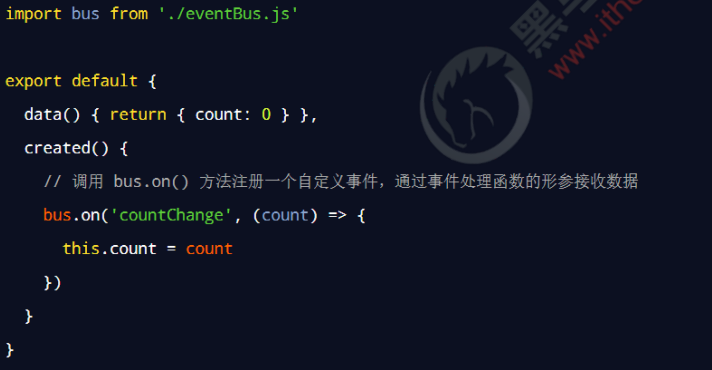
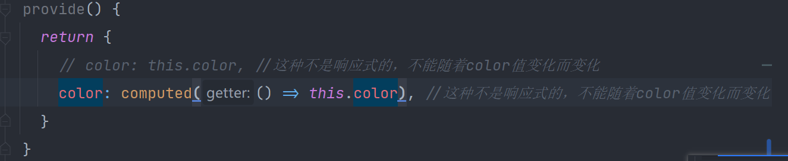
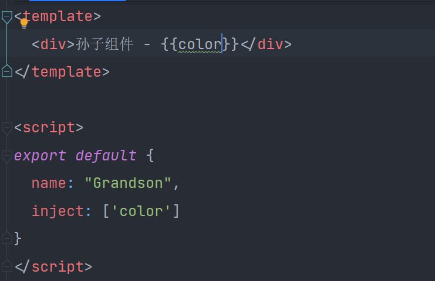
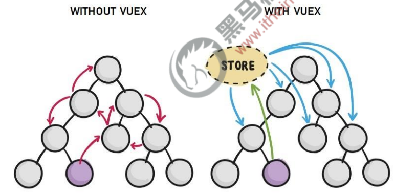

# watch 侦听器
## 例子
```vue
<template>
  <div>{{username}}</div>
  <button @click="username += '1'">+1</button>
</template>
<script>
export default {
  name: "WatchTest01",
  data() {
    return {
      username: ''
    }
  },
  watch: {
    username(newVal, oldVal) {
      console.log(newVal.length,oldVal.length)
    }
  }
}
</script>
```
## immediate
```vue
<script>
import axios from 'axios'
export default {
  name: "WatchTest01",
  data() {
    return {
      username: '111'
    }
  },
  watch: {
    username: {
      handler: async (newVal, oldVal) => {
        console.log(`oldVal: ${oldVal}`)
        const {data: res} = await axios.get(`https://www.escook.cn/api/finduser/${newVal}`)
        console.log(res)
      },
      immediate: true //表示组件初始化完成立即执行
    }
  }
}
</script>
```
## deep
- 当 watch 侦听的是一个对象，如果对象中的属性值发生了变化，则无法被监听到。此时需要使用 deep 选项
```vue
<template>
  <div>{{obj}}</div>
  <button @click="obj.name += '1'">点击</button>
</template>

<script>
export default {
  name: "WatchTest02",
  data() {
    return {
      obj: {
        name: ''
      }
    }
  },
  watch: {
    obj: {
      handler: (newVal,oldVal) => {
        console.log(newVal, oldVal)
      },
      deep: true
    }
  }
}
</script>
```
## 监听对象单个属性的变化
```vue
<script>
export default {
  name: "WatchTest02",
  data() {
    return {
      obj: {
        name: ''
      }
    }
  },
  watch: {
    "obj.name": {
      handler: (newVal, oldVal) => {
        console.log(newVal, oldVal)
      }
    }
  }
}
</script>
```
## 计算属性 vs 侦听器
- 计算属性侧重于监听多个值的变化，最终计算并返回一个新值
- 侦听器侧重于监听单个数据的变化，最终执行特定的业务处理，不需要有任何返回值
# 组件的生命周期

- 注意更新操作的条件
  - 改变字体颜色不会触发更新
```vue
<script>
export default {
  name: "LifecycleTest01",
  data() {
    return {
      flag: false
    }
  },
  methods: {
    change() {
      if (this.flag) {
        this.$refs.d.style.color = 'red'
      }else {
        this.$refs.d.style.color = 'blue'
      }
      this.flag = !this.flag
    }
  },
  beforeCreate() {
    console.log("元素创建之前")
  },
  // 最常用
  created() {
    console.log("元素被创建了")
  },
  beforeMount() {
    console.log('元素渲染之前')
  },
  mounted() {
    console.log("元素被渲染了")
  },
  beforeUpdate() {
    console.log("元素被更新之前")
  },
  updated() {
    console.log("元素被更新了")
  },
  beforeUnmount() {
    console.log("元素被销毁之前")
  },
  unmounted() {
    console.log("元素被销毁了")
  }
}
</script>
```
# 组件之间的数据共享
## 父向子
- 子：props里面设置
- 父：v-bind子的props里面的属性

## 子向父
### 子组件通过自定义事件的方式向父组件共享数据。

### 父子组件之间数据的双向同步

## 兄弟间
- 兄弟组件之间实现数据共享的方案是 EventBus。
- 可以借助于第三方的包 mitt 来创建 eventBus 对象，从而实现兄弟组件之间的数据共享。
**安装**
- npm i mitt@2.1.0
**配置**

**发送方**

**接收方**

## 后代关系组件之间的数据共享
- 使用 provide 和 inject 实现后代关系组件之间的数据共享
**注意**
  - 不要忘记导包: `import {computed} from "vue";`
  - 使用响应式，可以不需要加 `value`了，警告信息有这个提示


## vuex

# vue 3.x 中全局配置 axios
