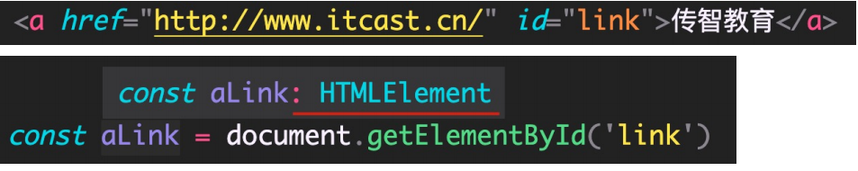

# 简介
## TypeScript 的特性
- TypeScript 是静态类型
  - 静态类型是指编译阶段就能确定每个变量的类型，这种语言的类型错误往往会导致语法错误。
  - TypeScript 在运行前需要先编译为 JavaScript，而在编译阶段就会进行类型检查。
- TypeScript 是弱类型
  - 类型系统按照「是否允许隐式类型转换」来分类，可以分为强类型和弱类型。
  - TypeScript 是完全兼容 JavaScript 的，它不会修改 JavaScript 运行时的特性，所以它们都是弱类型。
- hello.ts
```ts
function sayHello(person: string) {
  return 'Hello, '+person
}

let user = '林叶润'

console.log(sayHello(user))
```


# TypeScript 初体验
- npm i -g typescript
  - 将ts编译成js代码
  - 命令：tsc xxx.tx
  - 所有合法的 JS 代码都是 TS 代码，有 JS 基础只需要学习 TS 的类型即可。
  - 由 TS 编译生成的 JS 文件，代码中就没有类型信息了。
- npm i -g ts-node
  - ts-node xxx.ts
  - ts-node 命令在内部偷偷的将 TS -> JS，然后，再运行 JS 代码

# TypeScript 常用类型
- TypeScript 类型系统的主要优势：可以显示标记出代码中的意外行为，从而降低了发生错误的可能性。
## 类型注解
- 例子: `let age: number = 10`
  - 代码中的 : number 就是类型注解。
  - 为变量添加类型约束。比如，上述代码中，约定变量 age 的类型为 number（数值类型）。
  - 约定了什么类型，就只能给变量赋值该类型的值，否则，就会报错。

## 常用基础类型概述
- 以将 TS 中的常用基础类型细分为两类：1 JS 已有类型 2 TS 新增类型。
  - JS 已有类型
    - 原始类型：number/string/boolean/null/undefined/symbol。
    - 对象类型：object（包括，数组、对象、函数等对象）
  - TS 新增类型
    - 联合类型、自定义类型（类型别名）、接口、元组、字面量类型、枚举、void、any 等。

## 原始类型
- 原始类型：number/string/boolean/null/undefined/symbol
- 特点：简单。这些类型，完全按照 JS 中类型的名称来书写。
```ts
let isDone: boolean = false

let num: number

let str: string
```
## 数组类型
- 对象类型：object（包括，数组、对象、函数等对象）
- 特点：对象类型，在 TS 中更加细化，每个具体的对象都有自己的类型语法。
```ts
let arr01: number[] = [1, 2, 3] //推荐写法

let arr02: string[] = ['1', '2', '3']

let arr03: Array<string> = ['1', '22', '333']

//解释：| (竖线)在 TS 中叫做联合类型
// 由两个或多个其他类型组成的类型，表示可以是这些类型中的任意一种
let arr04: (number | string)[] = ['1', 1, '22', 22, '333', 333]
```
## 类型别名
- 使用场景：当同一类型（复杂）被多次使用时，可以通过类型别名，简化该类型的使用。
```ts
type CustomerArray = (number | string)[]

let arr01: CustomerArray = [1,2,3,'1','2','3']

let arr02: CustomerArray = ['x','y',6,7]
```
## 函数类型
- 函数的类型实际上指的是：函数参数和返回值的类型
- 同时指定参数、返回值的类型：例子2
- 如果函数没有返回值，那么，函数返回值类型为：void。
- 使用函数实现某个功能时，参数可以传也可以不传。这种情况下，在给函数参数指定类型时，就用到可选参数了。
  - 在可传可不传的参数名称后面添加 ?（问号）。
  - 可选参数只能出现在参数列表的最后，也就是说**可选参数后面不能再出现必选参数**。
```ts
// 1.
function add(num1: number, num2: number): number {
  return num1 + num2
}

const sub = (num1: number, num2: number): number => {
  return num1 - num2
}

console.log(add(1,2))
console.log(sub(1,2))

// 2. 当函数作为表达式时，可以通过类似箭头函数形式的语法来为函数添加类型。
// 这种形式只适用于函数表达式。
const mul: (num1: number, num2: number) => number = (num1, num2) => {
  return num1*num2
}
console.log(mul(1, 2));

// 3. 如果函数没有返回值，那么，函数返回值类型为：void。
function f(name: string): void {
  console.log('Hello,'+name)
}

f('随风的叶子')

// 4. 可选参数学习
// 可选参数后面不能存在必选参数了
function mySlice(start?: number, end?: number) {
  console.log('起始索引: ',start,'结束索引: ',end) //打印 undefined
}
mySlice()

function HaHa(str1: string, str2?: string):void {
  if (str2 === undefined) console.log(str1,',','world!')
  else console.log(str1,',',str2)
}
HaHa('Hi', '磐石')
HaHa('Hello')
```
## 对象类型
- JS 中的对象是由属性和方法构成的，而 TS 中对象的类型就是在描述对象的结构（有什么类型的属性和方法）
  - 直接使用 {} 来描述对象结构。属性采用属性名: 类型的形式；方法采用方法名(): 返回值类型的形式。
  - 如果方法有参数，就在方法名后面的小括号中指定参数类型（比如：greet(name: string): void）。
  - 在一行代码中指定对象的多个属性类型时，使用 ;（分号）来分隔。
    - 如果一行代码只指定一个属性类型（通过换行来分隔多个属性类型），可以去掉 ;（分号）。
    - 方法的类型也可以使用箭头函数形式（比如：{ sayHi: () => void }）。
  - 对象的属性或方法，也可以是可选的，此时就用到可选属性了。
```ts
let person: {name: string; age: number; sayHi: (string) => void; sayHello?(): void}

person = {
  name: '随风的叶子',
  age: 21,
  sayHi: (name: string) => {
    console.log('Hello,'+name)
  }
}

// sayHi可选
function sayHi(person: {name: string; sayHi?: (string) => void}) {
  if (person.sayHi === undefined) console.log('Hello,', person.name)
  else person.sayHi(person.name)
}

// 传进来的对象只有包含对象里面的东西就可以了
sayHi(person)
```
## 接口
- 当一个对象类型被多次使用时，一般会使用接口（interface）来描述对象的类型，达到复用的目的。
  - 使用 interface 关键字来声明接口。
  - 接口名称（比如，此处的 IPerson），可以是任意合法的变量名称。
  - 声明接口后，直接使用接口名称作为变量的类型。
  - 因为每一行只有一个属性类型，因此，属性类型后没有 ;（分号）。
- 如果两个接口之间有相同的属性或方法，可以将公共的属性或方法抽离出来，通过继承来实现复用。
  - 可以继承多个
```ts
// 一行一个，无需分隔符了
interface IPerson {
  name: string
  age: number
  sayHi(name: string): void
  add?: (n1:number,n2:number) => number
}

interface A {name: string;age: number}

// 继承,抽取公共部分
interface Point2D {
  x: number
  y: number
}

// interface Point3D {
//   x: number
//   y: number
//   z: number
// }

interface Point3D extends Point2D {
  z : number
}
```
## 元组
- 元组类型是另一种类型的数组，它确切地知道包含多少个元素，以及特定索引对应的类型。
  - 元组类型可以确切地标记出有多少个元素，以及每个元素的类型。
**例子**
```ts
let position: [number, number]
position = [1,2]
```
## 类型推论
- 在 TS 中，某些没有明确指出类型的地方，TS 的类型推论机制会帮助提供类型。
- 发生类型推论的 两 种常见场景：
  - 1 声明变量并初始化时
  - 2 决定函数返回值时
- 推荐：能省略类型注解的地方就省略（偷懒，充分利用TS类型推论的能力，提升开发效率）
```ts
let num = 10
let str = '123'

function add(n1: number, n2: number) {
  return n1+ n2
}
```
## 类型断言
**要使用类型断言指定更加具体的类型**

- 这个类型太宽泛（不具体），无法操作 href 等 a 标签特有的属性或方法。
- 解决方式：这种情况下就需要**使用类型断言指定更加具体的类型**。
使用类型断言：

  - 使用 as 关键字实现类型断言
  - 关键字 as 后面的类型是一个更加具体的类型（HTMLAnchorElement 是 HTMLElement 的子类型）
  - 通过类型断言，aLink 的类型变得更加具体，这样就可以访问 a 标签特有的属性或方法了。

  - 这种写法不常用

技巧：在浏览器控制台，通过 console.dir() 打印 DOM 元素，在属性列表的最后面，即可看到该元素的类型。

```ts
interface IPersonDad {
  name: string
}

interface IPersonSon extends IPersonDad {
  age: number
}

function f(): IPersonDad {
  return {
    name: '随风的叶子'
  }
}

const p = f() as IPersonSon
```
## 字面量类型字面量类型
```ts
let str1 = 'Hello ts'

const str2 = 'Hello ts' // 这个属于字面量类型, 把鼠标放过去就显示出来了

function f(direction: ('Left' | 'Right' | 'Top' | 'Down')) {
  if (direction === 'Left') {
    console.log('进行左移操作')
  }else if (direction === 'Right') {
    console.log('进行右移操作')
  }else if (direction === 'Top') {
    console.log('进行上移操作')
  }else if (direction === 'Down'){
    console.log('进行下移操作')
  }
}

let str = 'Left'

f('Left') //传str变量进去会报错
```
## 枚举
- 一般情况下，推荐使用字面量类型+联合类型组合的方式，因为相比枚举，这种方式更加直观、简洁、高效。
- 字符串枚举的每个成员必须有初始值。
```ts
enum Direction {
  Up,
  Down,
  Left,
  Right
}

function f1(direction: Direction) {
  console.log(direction)
}

f1(Direction.Left)
f1(Direction.Right)
f1(Direction.Up)
f1(Direction.Down)

// 数字可以玩得花一点
enum Enum01 {
  A = 100,
  B,
  C,
  D
}

enum Enum02 {
  A = 100,
  B = 200,
  C = 300,
  D = 400
}

// 字符串玩起来(这个就没有自增的作用了)
enum Dir {
  Up = 'UP',
  Down = 'DOWN',
  Left = 'LEFT',
  Right = 'RIGHT'
}
```
## any 类型
- 原则：不推荐使用 any！
  - 会失去 TS 类型保护的优势
- 尽可能的避免使用 any 类型，除非临时使用 any 来“避免”书写很长、很复杂的类型！
- 其他隐式具有 any 类型的情况
  - 声明变量不提供类型也不提供默认值
  - 函数参数不加类型
```ts
// 哪怕下面的代码出错了，也不会在编译器暴露出来
let obj: any = {x: 0}
obj.bar = 100
obj()
const n:number = obj
```
```ts
//any类型
let o 

//obj是any类型类型
function f(obj) {
  
}
```
## typeof
- 使用场景：根据已有变量的值，获取该值的类型，来简化类型书写。
- 实际上，TS 也提供了 typeof 操作符：可以在类型上下文中引用变量或属性的类型（类型查询）
- 注意
  - typeof 出现在**类型注解的位置**（参数名称的冒号后面）**所处的环境就在类型上下文**（区别于 JS 代码）。
  - typeof 只能用来**查询变量或属性的类型**，无法查询其他形式的类型（比如，函数调用的类型）。
```ts
// 应用场景
let p = {name: '随风的叶子', age: 21}

// 繁写
function f1(person: {name: string, age: number}) {
  console.log(person)
}
f1(p)
//简写
function f2(person: typeof p) {
  console.log(person)
}
f2(p)

// 注意事项
console.log(typeof 1)
console.log(typeof p.name)
//无法查询其他形式的类型（比如，函数调用的类型）
console.log(typeof f1) //function
```
